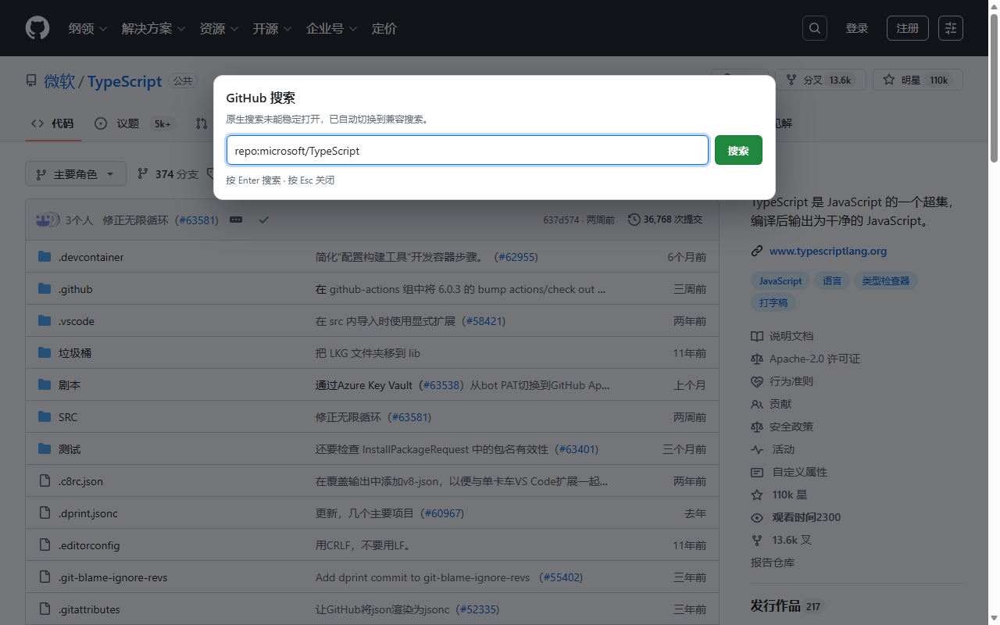

# Search Translate Guard for GitHub

让 Microsoft Edge 自动翻译与 GitHub 搜索稳定共存。

Search Translate Guard for GitHub keeps GitHub search usable while automatic page translation is active.



## 解决的问题

Microsoft Edge 的整页翻译会直接改写网页 DOM。在某些 GitHub 页面状态、刷新路径或加载时序下，这可能导致顶部搜索组件点击后消失，鼠标点击和 `/` 快捷键均无法打开搜索。

本扩展只作用于 `https://github.com/*`，不关闭自动翻译，也不改变浏览器翻译设置。

## 工作方式

扩展使用两层保护：

1. 在 GitHub 搜索组件出现时添加标准的 `translate="no"`，并覆盖初始加载、MutationObserver 动态节点与 GitHub Turbo 页面切换。
2. 用户点击搜索入口或按 / 后，检查原生搜索是否真正展开并获得可见输入框。若原生组件失败，约 550 ms 后自动显示本地兼容搜索框。
若未弹出兼容搜索框可按”/“键（位于键盘右shift旁）（搜索框快捷键）手动唤醒

原生搜索正常时不会被替换。兼容搜索框运行在 Shadow DOM 中，在仓库页面会保留当前 `repo:owner/repository` 搜索范围，并将查询直接交给 GitHub Search。

详细设计见 [docs/ARCHITECTURE.md](docs/ARCHITECTURE.md)。

## 安装

### Microsoft Edge Add-ons

等待商店版本发布后（审计中），可直接从 Microsoft Edge Add-ons 安装；无需开启开发人员模式。

### 本地安装

下载release的zip压缩包并解压到任意你能记住的位置


1. 克隆或下载本仓库/Releases 页面下载分发 ZIP
2. 在 Edge 打开 `edge://extensions/`。
3. 开启“开发人员模式”。
4. 点击“加载解压缩的扩展”，选择仓库根目录/解压后的文件夹。
5. 关闭已有 GitHub 标签页，再重新打开 GitHub。

本地解压缩扩展属于开发安装，Edge 可能显示开发人员模式安全提醒。

### 用户脚本

`GitHub-Search-Translate-Guard.user.js` 同时保留用户脚本元数据，可由可信的用户脚本管理器以 `document-start` 时机运行。商店扩展不依赖任何用户脚本管理器。

## 权限与隐私

- 仅匹配 `https://github.com/*`。
- 不申请浏览历史、标签页、Cookie、存储、身份、下载或剪贴板权限。
- 不包含广告、分析、遥测、账号、付费功能或远程代码。
- 不向开发者或独立服务收集、保存、出售、共享或传输用户数据。
- 查询提交后由浏览器直接访问 GitHub Search。

完整说明见 [PRIVACY.md](PRIVACY.md)。

## 开发与验证

```powershell
npm ci
npx playwright install chromium
npm run check
```

源代码位于 `src/`。`GitHub-Search-Translate-Guard.user.js` 是扩展与用户脚本共用的生成文件，请运行 `npm run build` 更新，不要直接编辑。

校验流程会检查生成文件、清单格式、默认语言、本地化引用、脚本与图标文件、版本和名称/简短说明长度，并拒绝常见远程代码模式。Playwright 会运行确定性的 DOM 翻译干扰与 GitHub 搜索回归测试。GitHub Actions 会对每次推送和拉取请求执行相同检查。

已验证的场景包括：连续刷新、慢速脚本资源、多个并行 GitHub 标签页、鼠标点击、`/` 快捷键、正常原生搜索和原生组件故障注入。

商店提交审计见 [docs/STORE-AUDIT.md](docs/STORE-AUDIT.md)。

通用内核设计见 [docs/ARCHITECTURE.md](docs/ARCHITECTURE.md)，跨站案例与方案取舍见 [docs/COMPATIBILITY-RESEARCH.md](docs/COMPATIBILITY-RESEARCH.md)。当前发布版本仍只作用于 GitHub。

## 贡献与安全

- 贡献指南：[CONTRIBUTING.md](CONTRIBUTING.md)
- 安全问题：[SECURITY.md](SECURITY.md)
- 变更记录：[CHANGELOG.md](CHANGELOG.md)

## 商标声明

本项目是独立第三方扩展，与 GitHub、Microsoft 或 Microsoft Edge 不存在隶属、认可或赞助关系。GitHub 和 Microsoft Edge 的名称仅用于准确说明兼容对象。项目图标为原创，不使用 GitHub、Microsoft 或 Edge 官方标志。

## License

[MIT License](LICENSE)
